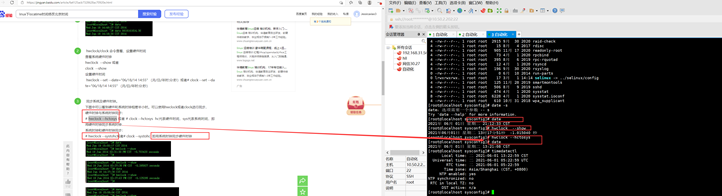

# 肖静的个人空间

欢迎来到我的个人空间，这里记录了我在技术学习、工作实践和生活感悟方面的内容。

## 📚 内容分类

### 💻 技术分享
涵盖了 MySQL、Docker、Linux、Qt 等技术领域的学习和实践经验，包括安装配置、常见问题解决和最佳实践。

### 📊 工作总结
记录了工作中遇到的问题、解决方案和常用工具的使用方法，帮助自己和他人快速解决类似问题。

### ❤️ 生活总结
分享生活中的点滴和感悟，记录重要的人生时刻。

## 🎯 近期更新

- **2025年度总结** - 总结过去一年的技术学习和工作成果
- **Docker容器化实践** - 分享使用 Docker 部署应用的经验
- **MySQL性能优化** - 探讨 MySQL 数据库性能优化的方法

## 📱 访问方式

本博客采用响应式设计，可以在桌面端、平板和手机上良好显示。

---

感谢您的访问！如果您有任何问题或建议，欢迎通过邮件联系我。

