## docker制作容器  2021/07/16 12:07:30 
---
###### 参考连接https://www.runoob.com/docker/docker-install-ubuntu.html
#### 1.拉取最新版的 Ubuntu 镜像
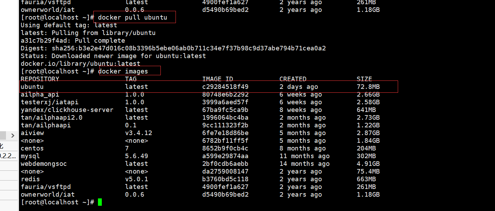

#### 2.创建并启动容器
docker run -it --name product_api_product  -p 10025:22 -p 10084:80 -p 10055:5000 ubuntu:latest 

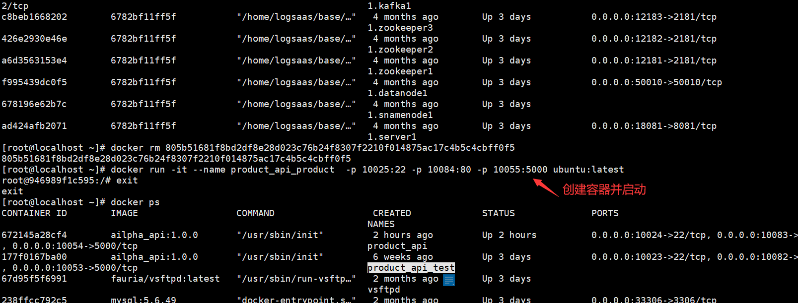

#### 3.进入刚才创建的容器
docker exec -it product_api_sj bash

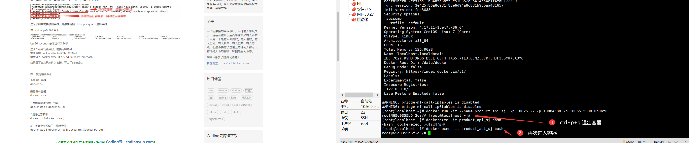

#### 4.安装各种工具包,4.1 安装ssh，参考文档https://www.cnblogs.com/mengw/p/11413461.html;
①执行更新： apt-get update
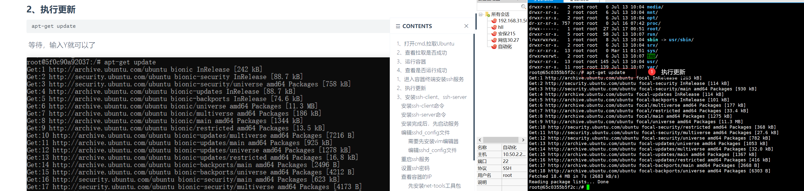
② 安装ssh-client命令：apt-get install openssh-client
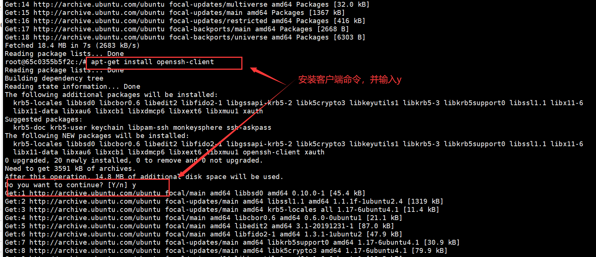
③安装ssh-server命令，注意要选择地区：apt-get install openssh-server
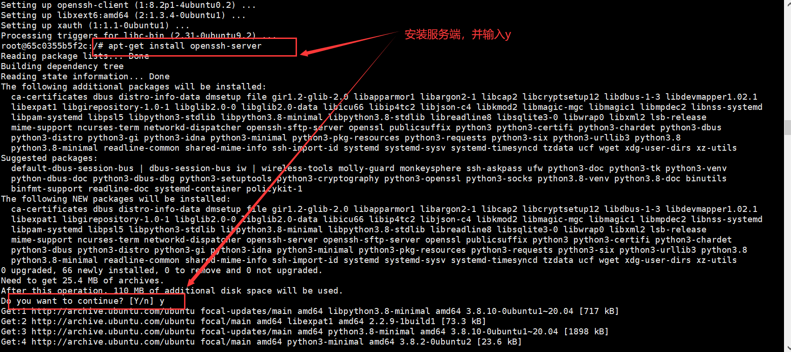
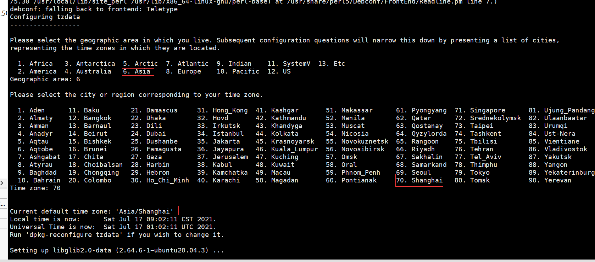
④启动服务，和检查是否正常启动：/etc/init.d/ssh start和ps -e|grep ssh
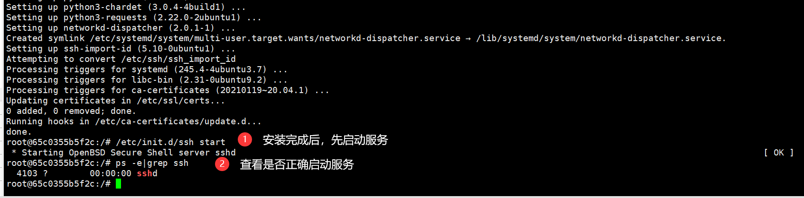
⑤编辑sshd_config文件。
1.先安装vim，命令：apt-get install vim
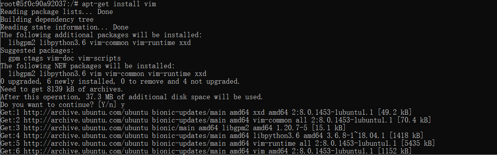
2.编辑sshd_config文件，命令：vim /etc/ssh/sshd_config，编辑好后保存退出  ESC + : + WQ
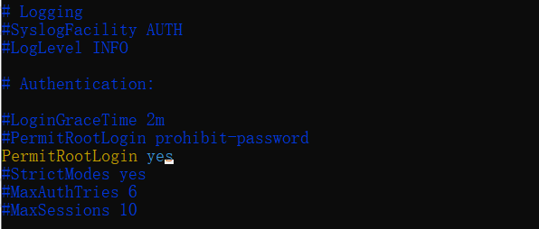
3.重启ssh服务和设置密码，命令：service ssh restart 和passwd root
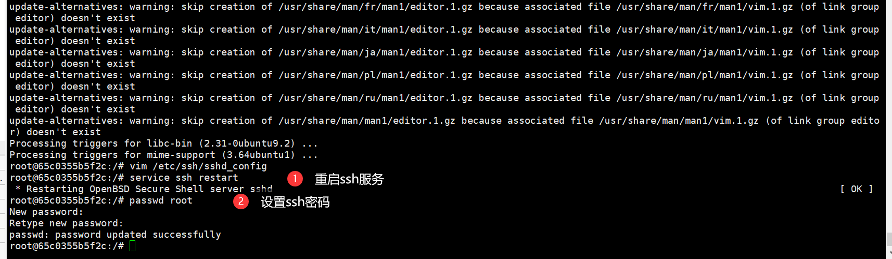
⑥查看容器的IP
1.安装net-tools工具包，命令：apt-get install net-tools
2.查看IP，命令：ifconfig
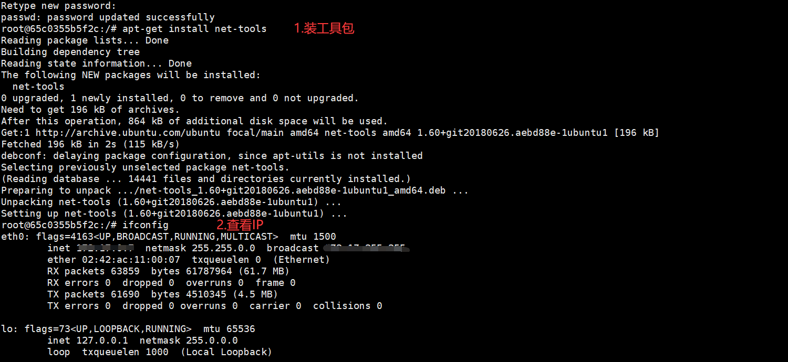

##### 4.2.检查是否有python，有就不用安装python：
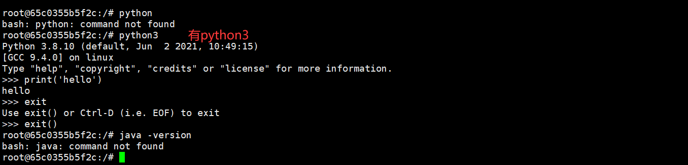

##### 4.3.已知下载好linux下的jdk,node,jmeter.手动解压安装Jdk，node,jmeter等：
①安装jdk，参考https://blog.csdn.net/weixin_38924500/article/details/106215048
1.创建文件夹，并解压，命令：sudo tar -axvf /tools/jdk-8u11-linux-x64.tar.gz -C /usr/local/jvm/

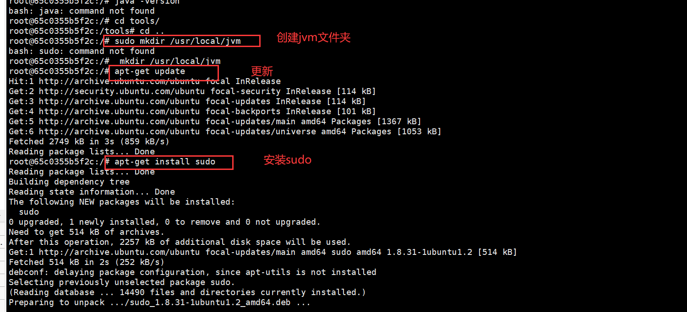
2.修改环境变量，命令：sudo vi ~/.bashrc
使环境变量马上生效，命令：source ~/.bashrc
系统注册此jdk,命令：sudo update-alternatives --install /usr/bin/java java /usr/local/jvm/jdk1.8.0_11/bin/java 300
查看jdk版本，命令：java -version
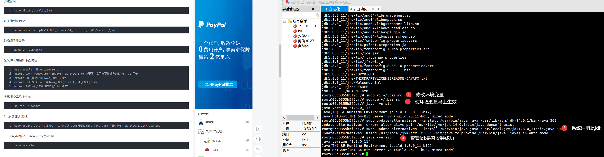
②安装jmeter.同安装jdk一样，先创建文件夹，再解压，改环境变量。
执行解压文件命令：sudo tar -zxvf /tools/apache-jmeter-5.4.1.tgz -C /usr/local/jmeter/
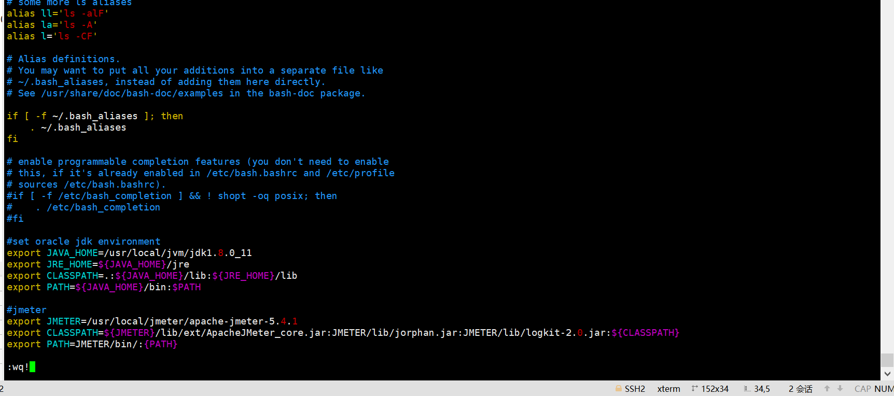
查看版本号:jmeter --version

③安装node,先解压，再加环境变量。
解压命令：sudo tar  -xvf /tools/node-v14.17.0-linux-x64.tar.xz -C /usr/local/nodejs/
查看版本号：node -v
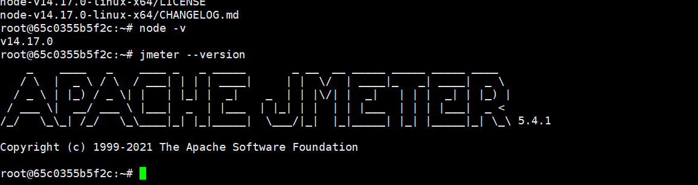

④安装nginx. 参考：https://blog.csdn.net/qq_23832313/article/details/83578836
1.安装依赖包（我也不知道这些依赖包有什么用）
apt-get install gcc
apt-get install libpcre3 libpcre3-dev
apt-get install zlib1g zlib1g-dev
sudo apt-get install openssl 
sudo apt-get install libssl-dev
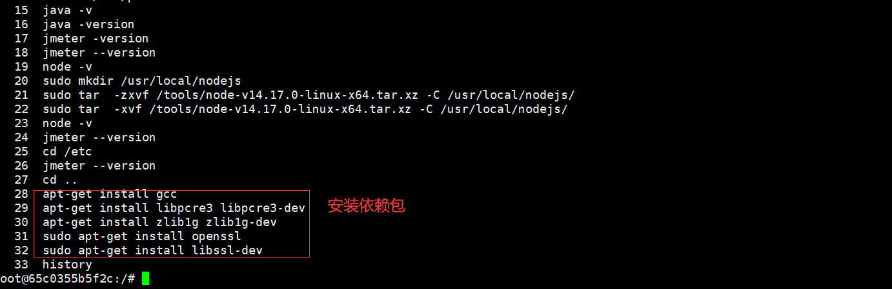
2.下载好的nginx压缩包放到服务器上，解压。其中，make命令没有，我重新安装的。
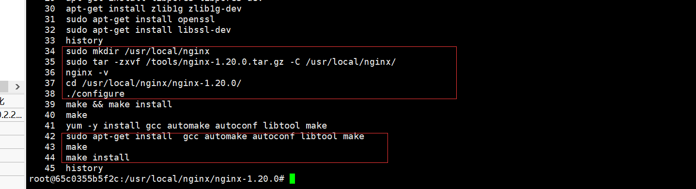
3.启动和检查nginx是否安装成功。
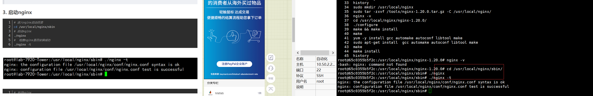

##### 4.4.安装gunicorn：
①检查没有pip,先安装pip,命令：sudo apt-get install python3-pip
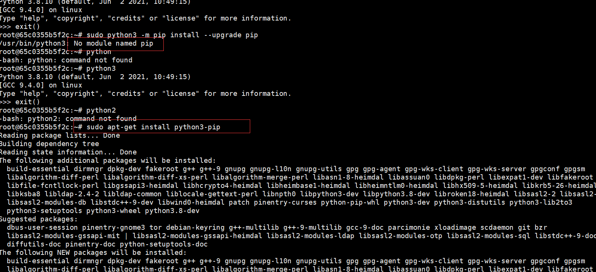
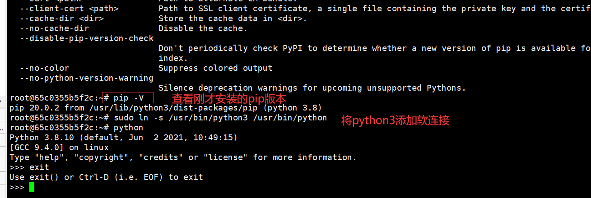
②安装gunicorn
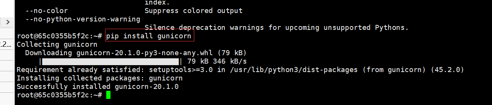
③安装虚拟环境，命令：
sudo apt-get install python-setuptools
sudo pip install virtualenv
④进入flask应用部署目录，创建虚拟环境并激活。
cd /home/ailpha_api/server
virtualenv venv
. venv/bin/activate
⑤各种需要安装的组件：requirements.txt
进入requirements.txt所在目录，执行命令： pip install -r requirements.txt 
其中安装报错ERROR: No matching distribution found for mysqlclient==2.0.3
，执行了以下依赖包后，重新安装组件。
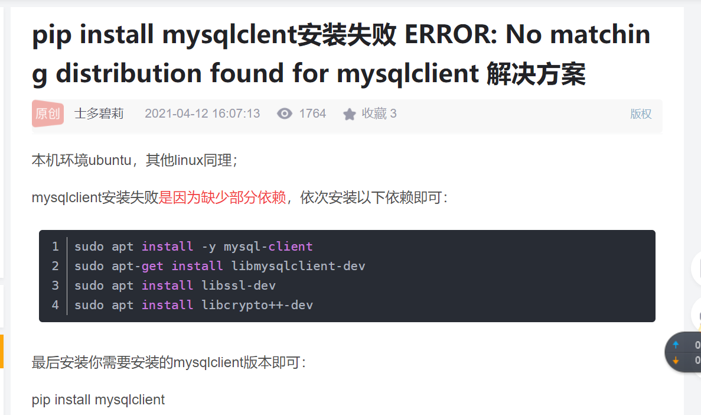

⑥注意运行时报错etrieving data from RDS gives AttributeError: 'sqlalchemy.cimmutabledict.immutabledict' object has no attribute 'setdefault'
解决方案：pip install --upgrade 'SQLAlchemy<1.4'，安装小于1.4版本的即可。

#### 5.启动程序，运行，访问
运行nginx的时候，报错，nginx: [emerg] open() "/var/log/nginx/access.log" failed (2: No such file or directory)
新建缺少的对应文件夹和文件即可。
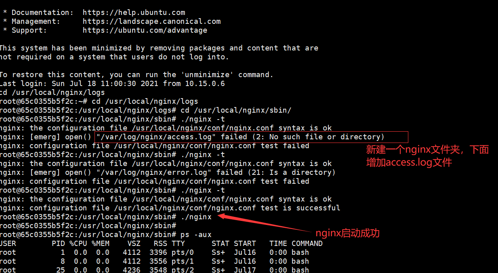

#### 7.容器内部获取信息,命令： docker inspect 容器id或者容器（如product_api）

启动iat容器# docker run -p 10026:22 -p 10085:80 -p 10056:5000 7e681a838153
apt-get update

apt-get install sudo

sudo apt-get install python3-pip
sudo apt-get install python-setuptools
sudo pip install virtualenv
virtualenv venv
. venv/bin/activate