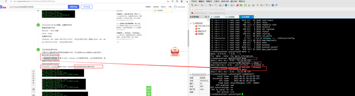
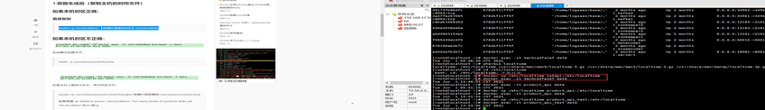

## linux下时间问题 2021/06/16 20:07:30 
---
修改linux系统时间: hwclock/clock 命令查看、设置硬件时间 查看系统硬件时钟
# hwclock --hctosys 或者 # clock --hctosys  hc代表硬件时间，sys代表系统时间，即用硬件时钟同步系统时钟
系统时钟和硬件时钟同步：

# hwclock --systohc或者# clock --systohc  即用系统时钟同步硬件时钟
---

---
容器内部署的应用，时间不对，排查方法：
1.确保宿主机时间是否正确；
2.如果正确的话，宿主机执行：docker cp /etc/localtime product_api_test:/etc/localtime
[root@localhost ~]# docker exec -it product_api_test date

---