## docker制作容器  2021/06/18 12:07:30 
---
###### 参考连接https://www.cnblogs.com/zipxzf/articles/14638272.html
#### 1.下载centos镜像
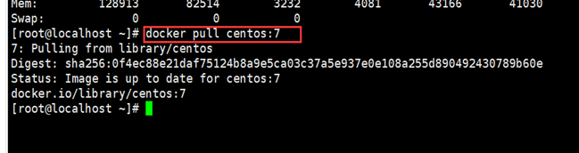

#### 2.创建并启动容器
docker run -d --name iatapi --privileged=true -p 10022:22 -p 10080:80 -h c7-docker-iatapi -v /home/fd/container/iatapi:/home/iatapi  centos:7 /usr/sbin/init

-d					后台运行方式
–-name				创建的容器名，方便启动、关闭、重启、删除容器等操作
–privileged=true	加上之后容器内部权限更多，不会出现权限问题
-p 10022:22 -p 10080:80	指定端口映射，可同时放通多个端口
-h testhost		指定容器主机名
-v /home/fd/container/centos7:/home/centos7	宿主机目录映射到容器内部目录
centos:7			本地centos镜像版本/或者镜像id
/usr/sbin/init		启动方式

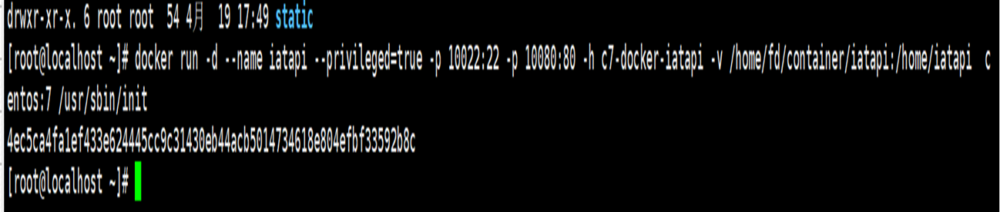

#### 3.进入刚才创建的容器
docker exec -it iatapi /bin/bash;
初始化yum : yum update
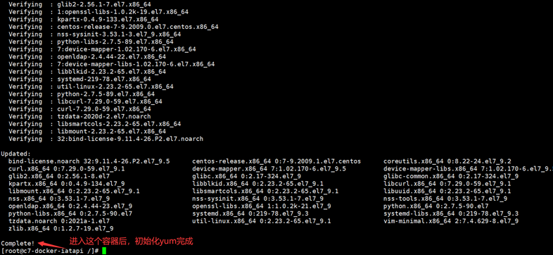

#### 4.安装各种工具包，更新yum为国内ali yum源：
cd /etc/yum.repo.d/
mkdir repos.bak
mv CentOS-* ./repos.bak/
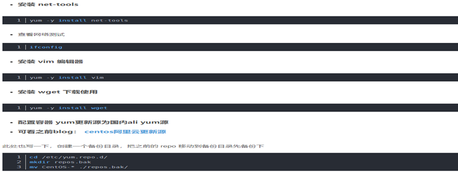

#### 5.更新yum为国内ali yum源：
wget -O /etc/yum.repos.d/CentOS-Base.repo https://mirrors.aliyun.com/repo/Centos-7.repo
yum clean all
yum makecache # 也可以是 yum makecache fast ，更快一些
yum update
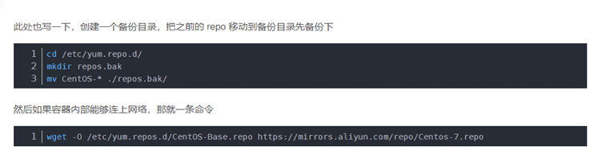

#### 6.安装基本软件
yum -y install systemd && \
yum -y install firewalld && \
yum -y install openssh openssh-server openssh-clients && \
systemctl start sshd && \
ssh-keygen -t rsa

yum install -y iproute
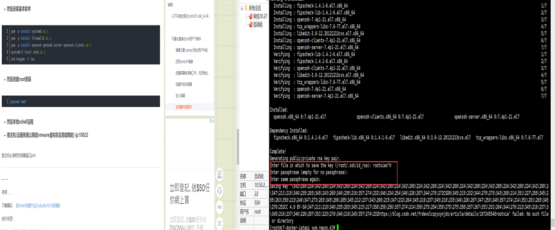

#### 7.安装依赖工具
yum install -y make wget yum install openssl-devel bzip2-devel expat-devel gdbm-devel readline-devel sqlite-devel mysql-devel gcc gcc-devel python-devel
安装python3
wget https://www.python.org/ftp/python/3.6.5/Python-3.6.5.tgz
（重新找个3.7的，这个连接下载解压后使用有问题）
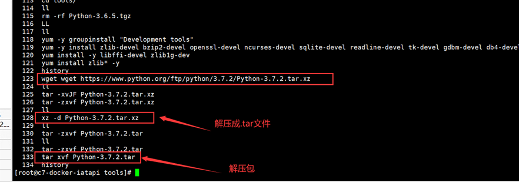

#### 8.增加系统环境变量，运行工程
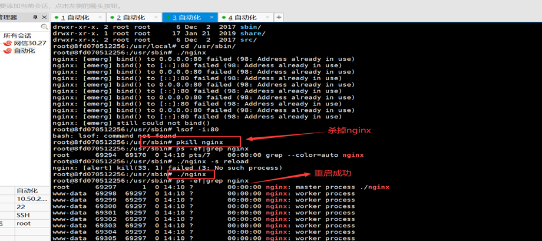

## 容器使用相关
#### 1.nginx重启不成功解决方案，直接pkill nginx

#### 2.查看docker容器的操作系统：
cat /etc/issue
uname -a
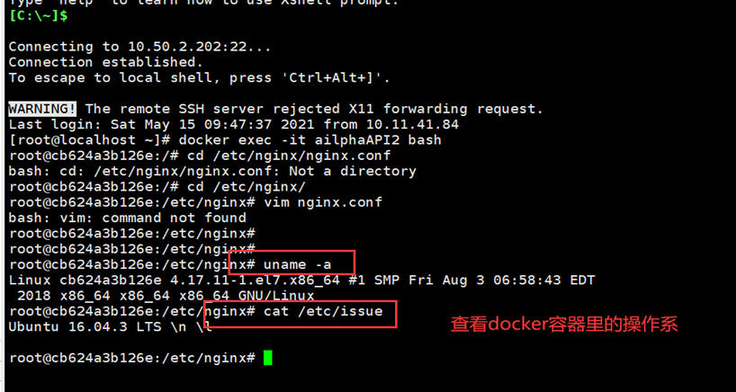

#### 3.容器重启，查看相关
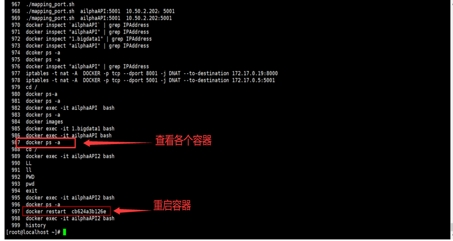

#### 4.进入flask工程部署的路径：
home/iatapi/
/usr/bin/python /usr/local/python37/bin/gunicorn -w4 -b0.0.0.0:5000 run:app
后台一直挂起
/usr/bin/python /usr/local/python37/bin/gunicorn -w4 -b0.0.0.0:5000 run:app    &
查看gunicorn的所有进程（ps -aux）

#### 5.建立jmeter软连接
ln -s /usr/jmeter/apache-jmeter-5.4.1/bin/jmeter /usr/bin/jmeter
ln -s /usr/jmeter/apache-jmeter-5.4.1/bin/jmeter-server /usr/bin/jmeter-server

#### 6.为什么每次进入命令都要重新source /etc/profile 才能生效。①~/.bashrc里面加一句source /etc/profile 然后执行一次 source ~/.bashrc 使该文件生效即可。
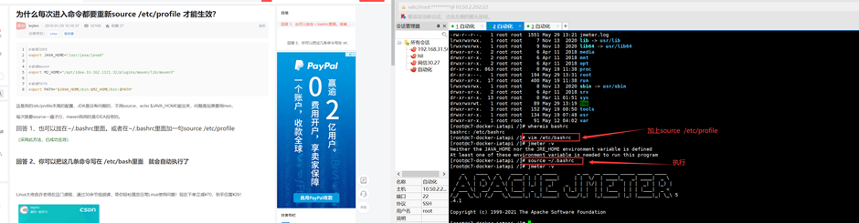