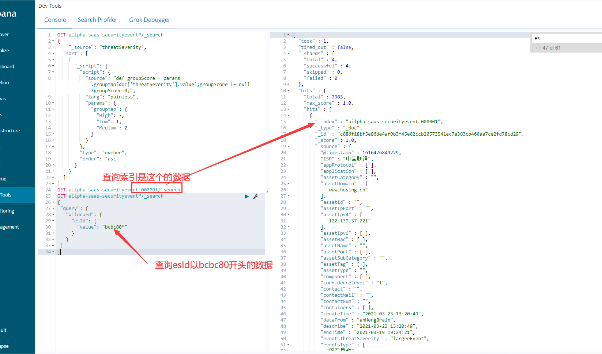
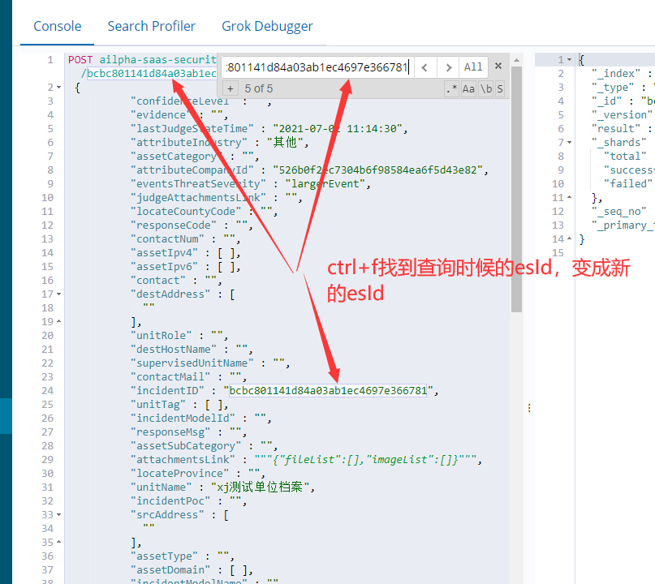
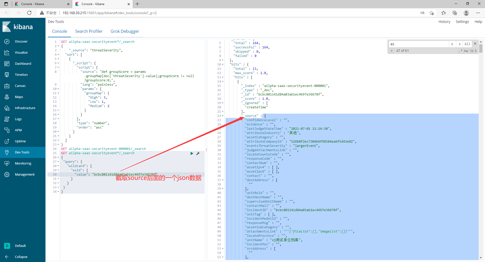
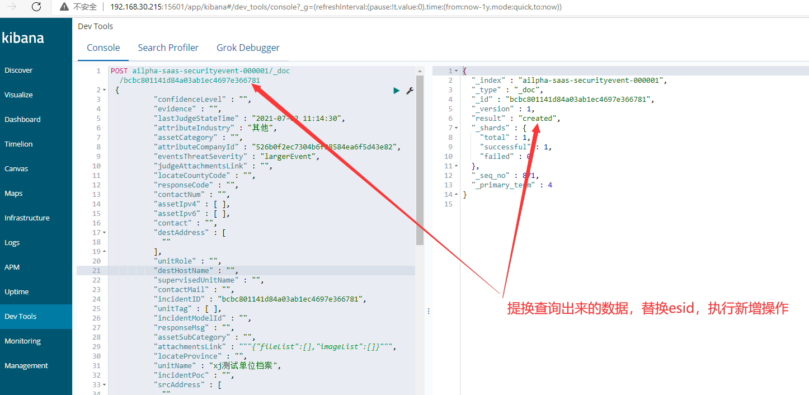
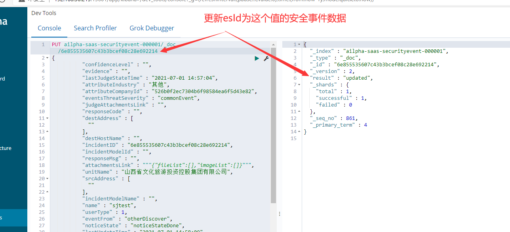

## es操作总结  2021/07/02 16:07:30 
---
### 1.查数据
如要查安全事件的数据
GET ailpha-saas-securityevent-000001/_search
GET ailpha-saas-securityevent*/_search
{
 "query": {
   "wildcard": {
     "esId": {
       "value": "bcbc801141d84a03ab1ec4697e36678f"
     }
   }
 }
}

### 2.每次新增一条数据
POST ailpha-saas-securityevent-000001/_doc/bcbc801141d84a03ab1ec4697e366781
{上一步查询出来的数据
}

替换edId未目前不存在的 执行

### 3.更新数据
POST ailpha-saas-securityevent-000001/_doc/bcbc801141d84a03ab1ec4697e366781（POST换成PUT也行）
