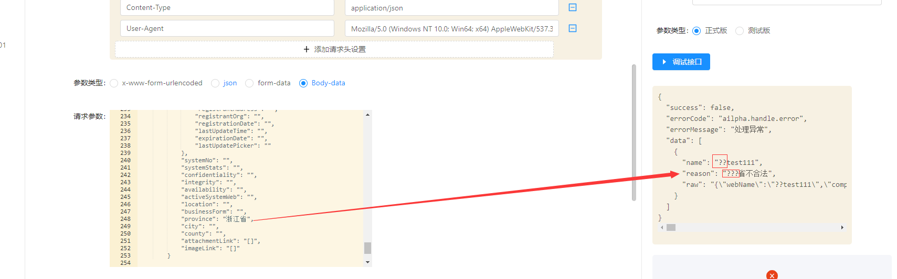
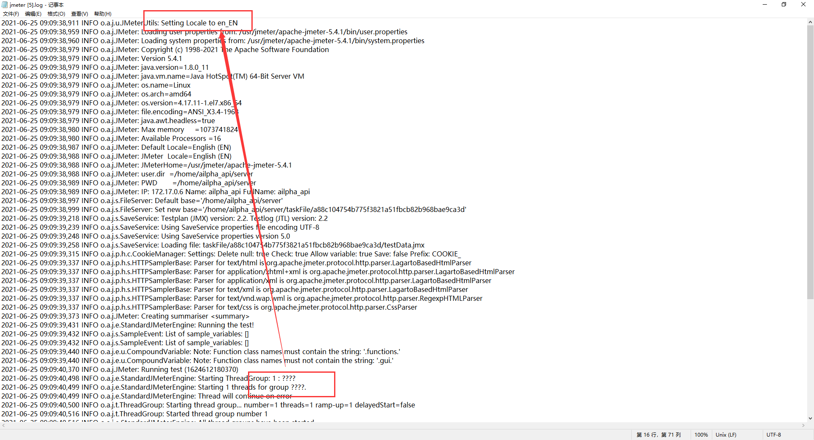

## Linux下执行jmeter脚本，请求content中文显示为问号？  2021/06/25 17:07:30 
---
### 1.现象截图

### 2.代码排查
经过排查，发现写入的jmx脚本，中文显示不对，更改了代码，以及更改代码后效果截图

### 3.更改代码后，执行还是报错，检查服务器配置，发现jmeter日志中，中文也显示问号。

猜测是不是linux下设置语言环境的原因，于是百度，配置了下，还是未解决jmeter日志中文显示问号
