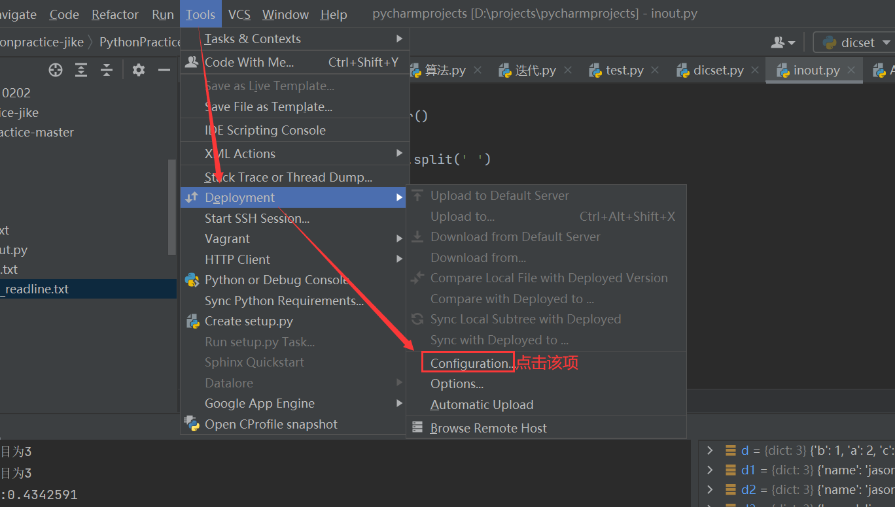
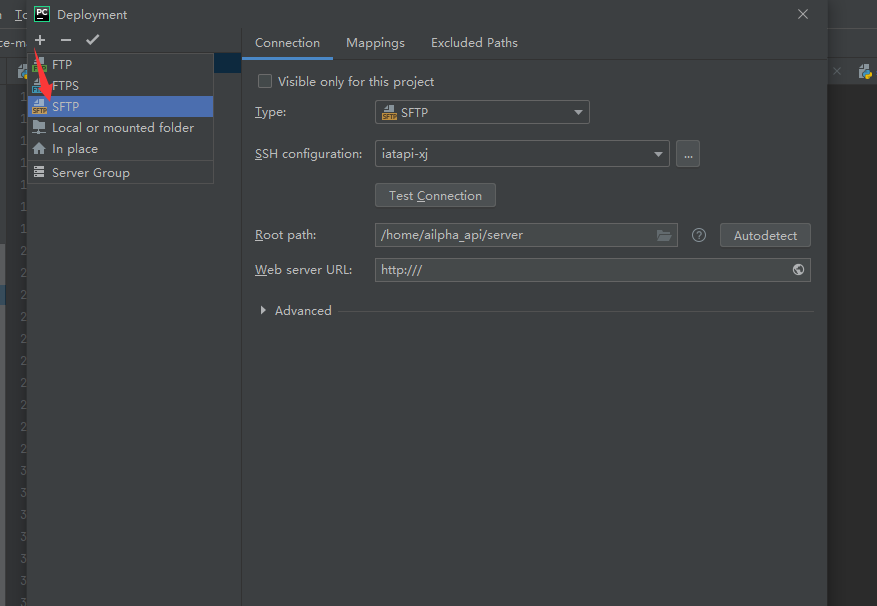

## 开发过程配置  2021/07/22 12:07:30 
前置条件：本地先装好python3+，以及设置好环境变量。
### 1.本地研发环境搭建
pycharm破解包安装,参考地址：https://www.789zhao.com/blog/JC7HPE5ZOT75.html
破解包找我私发，或者根据上面连接购买；

### 2.开始开发
#### 2.1 找我要最新的代码，或者连上服务器后，去服务器上拉取最新代码（下面2.3.5会说到如何从连接到的服务器拉取代码到本地）。

#### 2.2 打开pycharm，打开工程项目。

#### 2.3 远程服务器配置
2.3.1 找到路径Tools-Deployment-Configuration

2.3.2 打开的页面，点击添加按钮，选择SFTP；

2.3.3 打开的页面，点击省略号，弹出的页面效果如下，连接账密私下找我要，填好信息后，记得测试连接能否连上；

2.3.4 选择远程目标目录和配置映射路径；

2.3.5 配置完成后，可以进行上传下载等操作同步代码，如下图：

2.3.5 配置远程interpreter；
①在pycharm中，依次点击如下按钮
file --- > settings --- > Project interpreter，
②然后点击右边的齿轮，如下图：
③点击ssh interpreter，再选者Existing environment，如下图：

④也可修改远程解释器路径

⑤显示远程包；

2.3.6 远程运行，看是否运行正常。至此，远程连接配置完后，可以开始开发；

更改文件后，记得上传至服务器（建议一开始每个单文件上，点击右键 上传至服务器）

