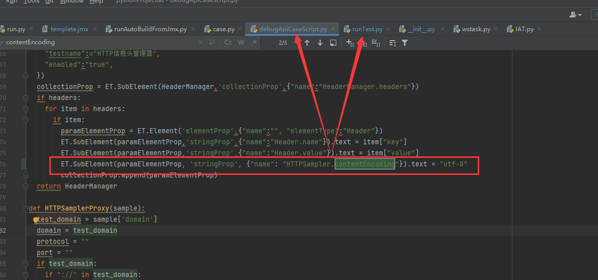

## 执行jmeter脚本，请求接口严格校验中文内容，中文内容传参为“？”报错  2021/06/25 17:07:30 
---
### 1.现象截图

### 2.代码排查
经过排查，发现写入的jmx脚本，中文显示不对，更改了代码，以及更改代码后效果截图

### 3.更改代码后，执行还是报错，检查服务器配置，发现jmeter日志中，中文也显示问号。

猜测是不是linux下设置语言环境的原因，于是百度，配置了下，还是未解决jmeter日志中文显示问号

## update  2021-06-29 12:12
由于上面linux语言环境未设置成功，今天又改变了下思路，重新整理问题。
1.用平台生成好的脚本，放到jmeter里面执行，看运行结果，发现加上
“ -#<stringProp name="HTTPSampler.contentEncoding">utf-8</stringProp> ”就能运行成功。

2.于是在代码里找关于生成脚本的地方，都加上了该指定编码的脚本。

3.再次调用接口运行，运行成功。
